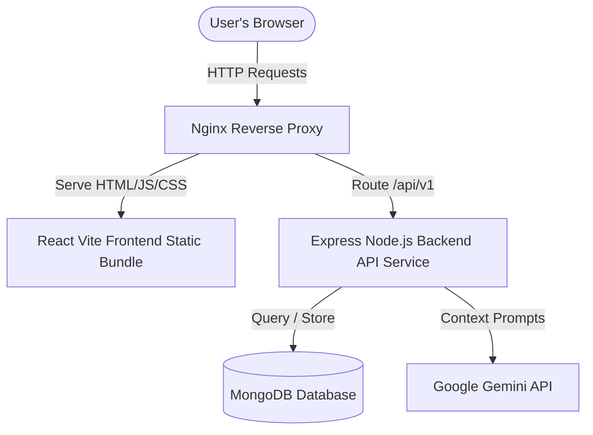

# Architecture Blueprints – AgriTrack AI

AgriTrack AI is an IoT-enabled telemetry tracking and agricultural data analysis platform.

## System Topology & Flow



## Folder Layout

```
├── .github/workflows/          # CI Pipeline Actions
├── backend/
│   ├── ai/                     # AI Providers & Context Management
│   ├── config/                 # DB & AI Config Loaders
│   ├── controllers/            # API Endpoints Business Handlers
│   ├── middleware/             # Security, Rate limiters, request loggers
│   ├── models/                 # Mongoose Database Schemas
│   ├── routes/                 # Express API Endpoint Maps
│   ├── utils/                  # Winston logs, backups, and scheduler engines
│   └── Dockerfile              # Backend Multi-Stage Docker Builder
├── src/                        # React Frontend Source Files
│   ├── components/             # Reusable UI widgets & Boundaries
│   ├── context/                # Theme, Auth, Toast contexts
│   ├── layouts/                # Dashboard Nav layouts
│   └── pages/                  # Route views (Dashboard, Machinery, etc.)
├── Dockerfile                  # Frontend static Docker compiler
├── nginx.conf                  # Reverse proxy server settings
└── docker-compose.yml          # Container configuration
```

## Security Routing & Authentication Loop

- **Trust Proxy enabled**: express captures original client IPs behind Nginx proxy.
- **Request Timings tracked**: Winston logs all API traffic metrics.
- **MongoDB sanitization**: Intercepts request parameters to block operator injection commands.
- **Context Engines Omit Keys**: Ensures passwords, secrets, sessionTokens, MongoObject IDs, and environment parameters are never included in prompts sent to Gemini.
